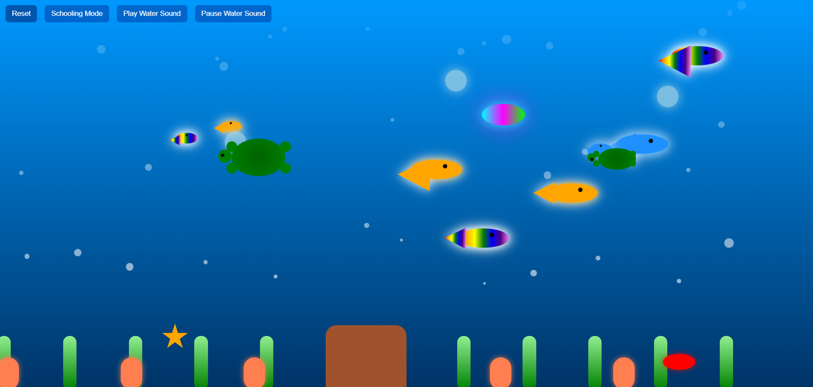

# Magical Water Tank 🐠🌊

An interactive, animated aquarium built with **HTML, CSS, and JavaScript**.  
It features colorful fishes, tortoises, jellyfish, starfish, crabs, neon fish, plants, bubbles, coral reefs, and a den — all swimming and moving inside a magical water tank.  
Background ambience is provided by looping **soft ocean waves** sound.

---

## ✨ Features
- **Continuous water ambience** (`soft-ocean-waves-sounds.m4a`) looping in the background.
- **Animated fishes** that swim randomly and escape when the cursor points at them.
- **Tortoises swim randomly** across the tank with paddling legs.
- **Schooling mode**: group fishes together in the center.
- **Reset button**: regenerate all creatures and decorations.
- **Interactive creatures**: tortoise family, jellyfish, starfish, crab, neon fish.
- **Decorations**: plants, bubbles, coral reefs, and a den.
- **Big Shark**: appears every 2 minutes, swims across the tank for 1 second, then disappears.

---

## 📂 Project Structure
# magical-water-tank/ │ ├── index.html
# Main HTML structure ├── style.css
# Aquarium visuals and animations ├── script.js
# Creature behaviors and interactions ├── 549334__kapilkant__soft-ocean-waves-sounds.m4a
# Background sound └── README.md
# Project documentation

---

## 🚀 Setup & Usage
1. Clone or download this repository.
2. Place all files (`index.html`, `style.css`, `script.js`, and your `.m4a` sound file) in the same folder.
3. Open `index.html` in any modern browser (Chrome, Edge, Firefox, Safari).
4. Enjoy your magical aquarium!

---

## 🔧 Controls
- **Reset** → Clears and regenerates all creatures.
- **Schooling Mode** → Groups fishes together.
- **Play Water Sound** → Starts background ambience.
- **Pause Water Sound** → Stops background ambience.

---

## 🎵 Audio
- Background sound file: `549334__kapilkant__soft-ocean-waves-sounds.m4a`  
  (You can replace this with any `.mp3` or `.m4a` file of your choice.)

---

## 🖼️ Preview Screenshot
Here’s a preview of the aquarium in action:

*(Save a screenshot of your aquarium as `preview.png` in the repo root. GitHub will automatically render it here.)*

---

## 📜 License
This project is for **personal and educational use**.  
Sound file credits: [Kapilkant on freesound.org](https://freesound.org/people/kapilkant/) (Soft Ocean Waves Sounds).

---
